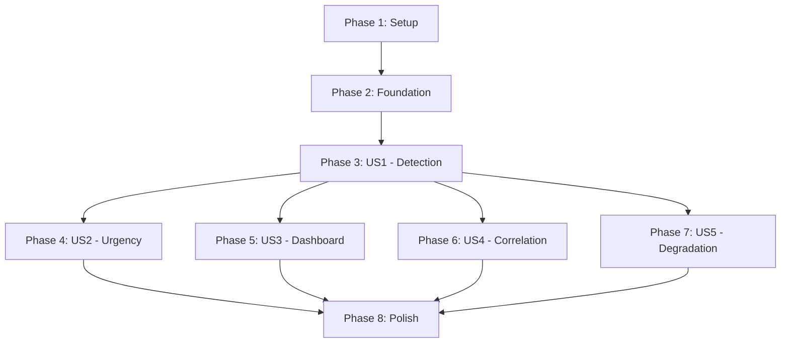

# Implementation Tasks: Real-time Mempool Whale Detection

**Branch**: `005-mempool-whale-realtime`
**Feature**: Real-time mempool whale detection with predictive signals
**Priority**: P1 (Core), P2 (Enhanced), P3 (Maintenance)

## Summary

This document defines implementation tasks for the real-time mempool whale detection system, organized by user story to enable independent development and testing. Each phase represents a complete, testable increment of functionality.

**Total Tasks**: 55
**Parallelizable**: 31 tasks marked with [P]
**User Stories**: 5 (US1-US5)

## Phase Organization

- **Phase 1**: Setup & Infrastructure (T001-T005)
- **Phase 2**: Foundational Components (T006-T010)
- **Phase 3**: User Story 1 - Real-time Whale Detection [P1] (T011-T020)
- **Phase 4**: User Story 2 - Fee-based Urgency Scoring [P2] (T021-T028)
- **Phase 5**: User Story 3 - Dashboard Visualization [P2] (T029-T037)
- **Phase 6**: User Story 4 - Historical Correlation [P3] (T038-T044)
- **Phase 7**: User Story 5 - Graceful Degradation [P3] (T045-T050)
- **Phase 8**: Polish & Cross-Cutting Concerns (T051-T055)

---

## Phase 1: Setup & Infrastructure

**Goal**: Initialize project structure and dependencies

- [ ] T001 Create project directory structure per implementation plan
- [ ] T002 [P] Install Python dependencies (websockets, asyncio, psutil) and update requirements.txt
- [ ] T003 [P] Initialize DuckDB database with schema in data/mempool_predictions.db
- [ ] T004 [P] Verify mempool.space WebSocket availability at ws://localhost:8999/ws/track-mempool-tx
- [ ] T005 [P] Create logging configuration with structured JSON output for production

---

## Phase 2: Foundational Components

**Goal**: Build core components required by all user stories

- [ ] T006 Create Pydantic models for MempoolWhaleSignal in scripts/models/whale_signal.py
- [ ] T007 [P] Create Pydantic models for PredictionOutcome in scripts/models/prediction_outcome.py
- [ ] T008 [P] Create Pydantic models for UrgencyMetrics in scripts/models/urgency_metrics.py
- [ ] T009 [P] Implement TransactionCache with bounded deque in scripts/utils/transaction_cache.py
- [ ] T010 Create shared configuration module in scripts/config/mempool_config.py

---

## Phase 3: User Story 1 - Real-time Whale Movement Detection [P1]

**Goal**: As a trader, I want to receive immediate alerts when whale transactions >100 BTC appear in mempool

**Independent Test**: Broadcast test transaction and verify alert within 1 second

### Implementation Tasks:

- [ ] T011 [US1] Create WebSocket client base class with reconnection in scripts/mempool_whale_monitor.py
- [ ] T012 [US1] Implement mempool.space WebSocket connection to /ws/track-mempool-tx endpoint
- [ ] T013 [US1] Add transaction stream parsing and validation logic
- [ ] T014 [US1] Integrate WhaleFlowDetector for transaction classification (>100 BTC threshold)
- [ ] T015 [US1] Implement alert generation with MempoolWhaleSignal creation
- [ ] T016 [US1] Add database persistence for predictions in DuckDB
- [ ] T017 [P] [US1] Create alert broadcaster WebSocket server in scripts/whale_alert_broadcaster.py
- [ ] T018 [P] [US1] Implement client connection management and broadcast logic
- [ ] T019 [P] [US1] Add unit tests for whale detection in tests/test_mempool_whale/test_monitor.py
- [ ] T020 [P] [US1] Create integration test for end-to-end flow in tests/integration/test_mempool_realtime.py

**Deliverable**: Working whale detection that alerts on >100 BTC transactions within 1 second

---

## Phase 4: User Story 2 - Fee-based Urgency Scoring [P2]

**Goal**: As a trader, I want to understand transaction urgency based on fee rates and RBF status

**Independent Test**: Submit transactions with varying fees and verify urgency scores

### Implementation Tasks:

- [ ] T021 [US2] Create urgency scorer module in scripts/whale_urgency_scorer.py
- [ ] T022 [US2] Implement fee rate to urgency score calculation (0.0-1.0 scale)
- [ ] T023 [US2] Add mempool.space fee estimates API integration for dynamic thresholds
- [ ] T024 [US2] Implement RBF detection and confidence adjustment logic
- [ ] T025 [US2] Add predicted confirmation block estimation based on fee percentiles
- [ ] T026 [US2] Integrate urgency scoring into whale detection pipeline
- [ ] T027 [P] [US2] Create unit tests for urgency calculations in tests/test_mempool_whale/test_urgency_scorer.py
- [ ] T028 [P] [US2] Add urgency score display to alert messages

**Deliverable**: Whale alerts include urgency scores with fee-based confirmation predictions

---

## Phase 5: User Story 3 - Dashboard Visualization [P2]

**Goal**: As a trader, I want to see pending vs confirmed whale flows in separate dashboard sections

**Independent Test**: Verify dashboard shows distinct sections with real-time updates

### Implementation Tasks:

- [ ] T029 [US3] Create mempool predictions section in frontend/comparison.html
- [ ] T030 [US3] Implement WebSocket client in frontend/js/mempool_predictions.js
- [ ] T031 [US3] Add pending transactions table with real-time updates
- [ ] T032 [US3] Implement visual distinction (color/style) for pending vs confirmed
- [ ] T033 [US3] Add transaction status transition animations (pending → confirmed)
- [ ] T034 [US3] Implement RBF modification indicators in UI
- [ ] T035 [US3] Add memory usage indicator to dashboard
- [ ] T036 [P] [US3] Create REST API endpoints for historical queries in api/mempool_whale_endpoints.py
- [ ] T037 [P] [US3] Add dashboard filtering options (flow type, urgency, value)

**Deliverable**: Dashboard with clear pending/confirmed separation and real-time updates

---

## Phase 6: User Story 4 - Historical Correlation Tracking [P3]

**Goal**: As an operator, I want to track prediction accuracy over time

**Independent Test**: Run for 24 hours and verify correlation metrics

### Implementation Tasks:

- [ ] T038 [US4] Create correlation tracking module in scripts/correlation_tracker.py
- [ ] T039 [US4] Implement prediction outcome recording when transactions confirm
- [ ] T040 [US4] Add accuracy calculation logic (correct predictions / total)
- [ ] T041 [US4] Implement false positive/negative tracking
- [ ] T042 [US4] Create correlation statistics aggregation (daily/weekly/monthly)
- [ ] T043 [P] [US4] Add correlation metrics display to dashboard
- [ ] T044 [P] [US4] Implement 90-day data retention with automatic cleanup

**Deliverable**: Correlation tracking with accuracy metrics and 90-day history

---

## Phase 7: User Story 5 - Graceful Degradation [P3]

**Goal**: As an operator, I want the system to handle WebSocket failures gracefully

**Independent Test**: Disconnect WebSocket and verify fallback behavior

### Implementation Tasks:

- [ ] T045 [US5] Implement exponential backoff reconnection strategy
- [ ] T046 [US5] Add connection status monitoring and health checks
- [ ] T047 [US5] Create degraded mode indicator for dashboard
- [ ] T048 [US5] Implement operator alerts for connection failures
- [ ] T049 [US5] Add automatic recovery when connection restored
- [ ] T050 [P] [US5] Create unit tests for degradation scenarios in tests/test_mempool_whale/test_degradation.py

**Deliverable**: System continues operating with clear status during connection failures

---

## Phase 8: Polish & Cross-Cutting Concerns

**Goal**: Production readiness and operational excellence

- [ ] T051 Add memory pressure handling with 400MB threshold monitoring
- [ ] T052 [P] Implement rate limiting on API endpoints
- [ ] T053 [P] Add performance metrics collection (latency, throughput)
- [ ] T054 [P] Create operational documentation in docs/MEMPOOL_WHALE_OPERATIONS.md
- [ ] T055 [P] Add systemd service configuration for production deployment

---

## Dependencies & Execution Strategy

### User Story Dependencies



### Parallel Execution Opportunities

#### Phase 1 (Setup) - 4 parallel tasks:
```bash
# Can run simultaneously
T002 & T003 & T004 & T005
```

#### Phase 2 (Foundation) - 3 parallel tasks:
```bash
# After T006
T007 & T008 & T009
```

#### Phase 3 (US1) - 2 parallel groups:
```bash
# After core implementation (T011-T016)
T017 & T018  # Alert broadcaster
T019 & T020  # Tests
```

#### Phase 4 (US2) - 2 parallel tasks:
```bash
# After urgency implementation (T021-T026)
T027 & T028  # Tests and display
```

#### Phase 5 (US3) - 2 parallel tasks:
```bash
# After UI implementation (T029-T035)
T036 & T037  # REST API and filters
```

#### Phase 6 (US4) - 2 parallel tasks:
```bash
# After correlation logic (T038-T042)
T043 & T044  # Display and retention
```

#### Phase 8 (Polish) - 4 parallel tasks:
```bash
# All can run in parallel
T052 & T053 & T054 & T055
```

---

## Implementation Strategy

### MVP Scope (Phase 1-3)
- **Deliverable**: Basic whale detection with alerts
- **Timeline**: 2-3 days
- **Value**: Immediate predictive signals for traders

### Enhanced Features (Phase 4-5)
- **Deliverable**: Urgency scoring and dashboard
- **Timeline**: 2-3 days
- **Value**: Context and visualization for better decisions

### Production Readiness (Phase 6-8)
- **Deliverable**: Correlation tracking, resilience, operations
- **Timeline**: 2-3 days
- **Value**: Trust, reliability, maintainability

---

## Validation Checklist

- ✅ All tasks follow required format: `- [ ] T### [P] [US#] Description with file path`
- ✅ Each user story phase is independently testable
- ✅ Dependencies clearly defined between phases
- ✅ Parallel opportunities identified (31/55 tasks = 56%)
- ✅ File paths specified for all implementation tasks
- ✅ Test tasks included for critical functionality
- ✅ MVP clearly scoped to US1 (Phase 3)

---

## Quick Reference

| Phase | Tasks | User Story | Priority | Parallel |
|-------|-------|------------|----------|----------|
| 1 | T001-T005 | Setup | - | 4/5 |
| 2 | T006-T010 | Foundation | - | 3/5 |
| 3 | T011-T020 | US1: Detection | P1 | 4/10 |
| 4 | T021-T028 | US2: Urgency | P2 | 2/8 |
| 5 | T029-T037 | US3: Dashboard | P2 | 2/9 |
| 6 | T038-T044 | US4: Correlation | P3 | 2/7 |
| 7 | T045-T050 | US5: Degradation | P3 | 1/6 |
| 8 | T051-T055 | Polish | - | 4/5 |

**Total**: 55 tasks | **Parallel**: 31 tasks (56%) | **Stories**: 5