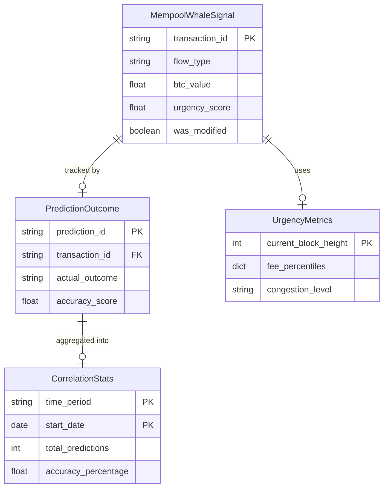

# Data Model Specification

**Feature**: Real-time Mempool Whale Detection
**Date**: 2025-11-07
**Phase**: 1 - Design & Contracts

## Core Entities

### MempoolWhaleSignal

Represents a predictive whale signal from an unconfirmed transaction in the mempool.

```python
class MempoolWhaleSignal:
    transaction_id: str           # Bitcoin transaction hash
    flow_type: str                # "inflow" | "outflow" | "internal" | "unknown"
    btc_value: float              # Total BTC amount (must be >100)
    fee_rate: float               # Satoshis per vByte
    urgency_score: float          # 0.0-1.0 based on fee rate
    rbf_enabled: bool             # True if Replace-By-Fee is signaled
    detection_timestamp: datetime  # When detected in mempool
    predicted_confirmation_block: int  # Estimated block height for confirmation
    exchange_addresses: List[str] # Involved exchange addresses
    confidence_score: float       # 0.0-1.0 combined whale + urgency confidence
    was_modified: bool = False    # True if RBF replacement occurred
```

**Validation Rules**:
- `transaction_id`: Must be valid 64-character hex string
- `flow_type`: Must be one of defined values
- `btc_value`: Must be > 100.0
- `urgency_score`: Must be between 0.0 and 1.0
- `fee_rate`: Must be > 0
- `confidence_score`: Must be between 0.0 and 1.0

**State Transitions**:
- `pending` → `confirmed` (when included in block)
- `pending` → `modified` (when RBF replacement)
- `pending` → `dropped` (when removed from mempool)
- `modified` → `confirmed` (when replacement confirms)

### PredictionOutcome

Tracks the result of each mempool prediction for correlation analysis.

```python
class PredictionOutcome:
    prediction_id: str           # Unique ID (UUID)
    transaction_id: str          # Original transaction hash
    predicted_flow: str          # Original prediction
    actual_outcome: str          # "confirmed" | "dropped" | "replaced"
    confirmation_time: Optional[datetime]  # When confirmed (if applicable)
    confirmation_block: Optional[int]      # Block height of confirmation
    accuracy_score: float        # 1.0 if correct, 0.0 if wrong
    time_to_confirmation: Optional[int]    # Minutes from prediction to confirmation
    final_fee_rate: Optional[float]        # Final fee rate if RBF modified
```

**Validation Rules**:
- `prediction_id`: Must be valid UUID
- `transaction_id`: Must be valid 64-character hex string
- `predicted_flow`: Must match original signal flow_type
- `actual_outcome`: Must be one of defined values
- `accuracy_score`: 0.0 or 1.0 only

### UrgencyMetrics

Real-time fee market data for urgency calculation.

```python
class UrgencyMetrics:
    current_block_height: int         # Current blockchain height
    fee_percentiles: Dict[int, float] # {10: low, 50: medium, 90: high}
    estimated_blocks_to_confirmation: Dict[str, int]  # By fee tier
    mempool_size_mb: float            # Current mempool size
    congestion_level: str             # "low" | "medium" | "high" | "extreme"
    last_update: datetime             # When metrics were refreshed
```

**Validation Rules**:
- `current_block_height`: Must be > 0
- `fee_percentiles`: Must have keys [10, 25, 50, 75, 90]
- `mempool_size_mb`: Must be >= 0
- `congestion_level`: Must be one of defined values

### CorrelationStats

Aggregated accuracy metrics for system performance tracking.

```python
class CorrelationStats:
    time_period: str                # "daily" | "weekly" | "monthly" | "quarterly"
    start_date: date
    end_date: date
    total_predictions: int
    confirmed_as_predicted: int     # Correct predictions
    false_positives: int            # Predicted but wrong/dropped
    false_negatives: int            # Missed whale transactions
    average_lead_time: float        # Minutes before confirmation
    accuracy_percentage: float      # (correct / total) * 100
    rbf_modification_rate: float    # Percentage of RBF replacements
```

**Validation Rules**:
- `time_period`: Must be one of defined values
- `end_date`: Must be >= start_date
- `total_predictions`: Must be >= 0
- `accuracy_percentage`: Must be between 0.0 and 100.0

## Relationships



## Database Schema

### DuckDB Tables

```sql
-- Main prediction tracking table
CREATE TABLE mempool_predictions (
    prediction_id TEXT PRIMARY KEY,
    transaction_id TEXT NOT NULL,
    flow_type TEXT NOT NULL CHECK (flow_type IN ('inflow', 'outflow', 'internal', 'unknown')),
    btc_value REAL NOT NULL CHECK (btc_value > 100),
    fee_rate REAL NOT NULL CHECK (fee_rate > 0),
    urgency_score REAL NOT NULL CHECK (urgency_score >= 0 AND urgency_score <= 1),
    rbf_enabled BOOLEAN NOT NULL,
    detection_timestamp TIMESTAMP NOT NULL,
    predicted_confirmation_block INTEGER,
    exchange_addresses TEXT,  -- JSON array
    confidence_score REAL CHECK (confidence_score >= 0 AND confidence_score <= 1),
    was_modified BOOLEAN DEFAULT FALSE,
    created_at TIMESTAMP DEFAULT CURRENT_TIMESTAMP
);

-- Prediction outcomes tracking
CREATE TABLE prediction_outcomes (
    outcome_id TEXT PRIMARY KEY,
    prediction_id TEXT NOT NULL REFERENCES mempool_predictions(prediction_id),
    transaction_id TEXT NOT NULL,
    predicted_flow TEXT NOT NULL,
    actual_outcome TEXT CHECK (actual_outcome IN ('confirmed', 'dropped', 'replaced')),
    confirmation_time TIMESTAMP,
    confirmation_block INTEGER,
    accuracy_score REAL CHECK (accuracy_score IN (0.0, 1.0)),
    time_to_confirmation INTEGER,  -- minutes
    final_fee_rate REAL,
    created_at TIMESTAMP DEFAULT CURRENT_TIMESTAMP
);

-- Urgency metrics snapshots
CREATE TABLE urgency_metrics (
    metric_id INTEGER PRIMARY KEY,
    current_block_height INTEGER NOT NULL,
    fee_percentiles TEXT NOT NULL,  -- JSON object
    estimated_blocks TEXT NOT NULL,  -- JSON object
    mempool_size_mb REAL NOT NULL,
    congestion_level TEXT CHECK (congestion_level IN ('low', 'medium', 'high', 'extreme')),
    created_at TIMESTAMP DEFAULT CURRENT_TIMESTAMP
);

-- Pre-aggregated correlation statistics
CREATE TABLE correlation_stats (
    time_period TEXT NOT NULL,
    start_date DATE NOT NULL,
    end_date DATE NOT NULL,
    total_predictions INTEGER NOT NULL,
    confirmed_as_predicted INTEGER NOT NULL,
    false_positives INTEGER NOT NULL,
    false_negatives INTEGER NOT NULL,
    average_lead_time REAL,
    accuracy_percentage REAL,
    rbf_modification_rate REAL,
    created_at TIMESTAMP DEFAULT CURRENT_TIMESTAMP,
    PRIMARY KEY (time_period, start_date)
);

-- Indexes for performance
CREATE INDEX idx_predictions_timestamp ON mempool_predictions(detection_timestamp);
CREATE INDEX idx_predictions_txid ON mempool_predictions(transaction_id);
CREATE INDEX idx_outcomes_prediction ON prediction_outcomes(prediction_id);
CREATE INDEX idx_outcomes_timestamp ON prediction_outcomes(confirmation_time);
CREATE INDEX idx_metrics_block ON urgency_metrics(current_block_height);
CREATE INDEX idx_stats_period ON correlation_stats(time_period, end_date);

-- Cleanup old data (90-day retention)
CREATE VIEW predictions_to_cleanup AS
SELECT prediction_id
FROM mempool_predictions
WHERE detection_timestamp < CURRENT_TIMESTAMP - INTERVAL '90 days';
```

## In-Memory Structures

### Active Transaction Cache

```python
from collections import deque
from dataclasses import dataclass
from typing import Dict, Optional

@dataclass
class ActiveTransaction:
    signal: MempoolWhaleSignal
    received_at: datetime
    last_modified: Optional[datetime] = None
    modification_count: int = 0

class TransactionCache:
    def __init__(self, max_size: int = 10000):
        self._cache: Dict[str, ActiveTransaction] = {}
        self._order = deque(maxlen=max_size)

    def add(self, signal: MempoolWhaleSignal):
        if len(self._cache) >= self._order.maxlen:
            # Remove oldest if at capacity
            oldest_txid = self._order.popleft()
            del self._cache[oldest_txid]

        self._cache[signal.transaction_id] = ActiveTransaction(
            signal=signal,
            received_at=datetime.now()
        )
        self._order.append(signal.transaction_id)

    def update_rbf(self, transaction_id: str, new_signal: MempoolWhaleSignal):
        if transaction_id in self._cache:
            entry = self._cache[transaction_id]
            entry.signal = new_signal
            entry.last_modified = datetime.now()
            entry.modification_count += 1
            entry.signal.was_modified = True

    def remove(self, transaction_id: str):
        if transaction_id in self._cache:
            del self._cache[transaction_id]
            # Note: Can't efficiently remove from deque, will be cleared eventually

    def get_memory_usage_mb(self) -> float:
        # Rough estimation: ~1KB per transaction
        return len(self._cache) * 0.001
```

## Message Schemas

### WebSocket Messages (JSON)

```json
// Whale Alert Message (Server → Client)
{
    "type": "whale_alert",
    "data": {
        "transaction_id": "abc123...",
        "flow_type": "inflow",
        "btc_value": 150.5,
        "fee_rate": 45.2,
        "urgency_score": 0.85,
        "rbf_enabled": false,
        "detection_timestamp": "2025-11-07T10:30:00Z",
        "predicted_confirmation_block": 922500,
        "exchange_addresses": ["1A1zP1...", "bc1qxy2k..."],
        "confidence_score": 0.78,
        "was_modified": false
    },
    "timestamp": "2025-11-07T10:30:00Z"
}

// Status Update Message (Server → Client)
{
    "type": "status_update",
    "data": {
        "transaction_id": "abc123...",
        "new_status": "confirmed",
        "confirmation_block": 922501,
        "confirmation_time": "2025-11-07T10:45:00Z"
    },
    "timestamp": "2025-11-07T10:45:00Z"
}

// Subscription Request (Client → Server)
{
    "type": "subscribe",
    "filters": {
        "min_btc_value": 100,
        "flow_types": ["inflow", "outflow"],
        "min_urgency": 0.5
    }
}

// Heartbeat (Bidirectional)
{
    "type": "ping",
    "timestamp": "2025-11-07T10:30:00Z"
}
```

## Pydantic Models

```python
from pydantic import BaseModel, Field, validator
from datetime import datetime
from typing import List, Optional, Dict
from enum import Enum

class FlowType(str, Enum):
    INFLOW = "inflow"
    OUTFLOW = "outflow"
    INTERNAL = "internal"
    UNKNOWN = "unknown"

class CongestionLevel(str, Enum):
    LOW = "low"
    MEDIUM = "medium"
    HIGH = "high"
    EXTREME = "extreme"

class MempoolWhaleSignalModel(BaseModel):
    transaction_id: str = Field(..., regex="^[0-9a-f]{64}$")
    flow_type: FlowType
    btc_value: float = Field(..., gt=100.0)
    fee_rate: float = Field(..., gt=0)
    urgency_score: float = Field(..., ge=0.0, le=1.0)
    rbf_enabled: bool
    detection_timestamp: datetime
    predicted_confirmation_block: Optional[int] = Field(None, gt=0)
    exchange_addresses: List[str]
    confidence_score: float = Field(..., ge=0.0, le=1.0)
    was_modified: bool = False

    @validator('exchange_addresses')
    def validate_addresses(cls, v):
        if not v:
            raise ValueError("At least one exchange address required")
        return v

class UrgencyMetricsModel(BaseModel):
    current_block_height: int = Field(..., gt=0)
    fee_percentiles: Dict[int, float]
    estimated_blocks_to_confirmation: Dict[str, int]
    mempool_size_mb: float = Field(..., ge=0)
    congestion_level: CongestionLevel
    last_update: datetime

    @validator('fee_percentiles')
    def validate_percentiles(cls, v):
        required_keys = {10, 25, 50, 75, 90}
        if not required_keys.issubset(v.keys()):
            raise ValueError(f"Must include percentiles: {required_keys}")
        return v
```

## Access Patterns

### Common Queries

1. **Get pending predictions** (every block)
```sql
SELECT * FROM mempool_predictions
WHERE prediction_id NOT IN (
    SELECT prediction_id FROM prediction_outcomes
)
ORDER BY detection_timestamp DESC;
```

2. **Calculate daily accuracy** (once per day)
```sql
SELECT
    DATE(detection_timestamp) as date,
    COUNT(*) as total,
    SUM(CASE WHEN accuracy_score = 1.0 THEN 1 ELSE 0 END) as correct,
    AVG(accuracy_score) * 100 as accuracy_pct
FROM mempool_predictions p
JOIN prediction_outcomes o ON p.prediction_id = o.prediction_id
WHERE detection_timestamp >= CURRENT_DATE - INTERVAL '1 day'
GROUP BY DATE(detection_timestamp);
```

3. **Get high-urgency alerts** (real-time filter)
```python
high_urgency = [
    signal for signal in active_signals
    if signal.urgency_score > 0.8 and signal.btc_value > 200
]
```

## Data Retention

- **Predictions**: 90 days (then archived or deleted)
- **Outcomes**: 90 days (kept with predictions)
- **Metrics**: 7 days of snapshots (hourly aggregation after)
- **Statistics**: Indefinite (pre-aggregated, small size)
- **In-memory cache**: ~10,000 transactions or 400MB limit

---

**Data Model Complete**: Ready for API contract generation.